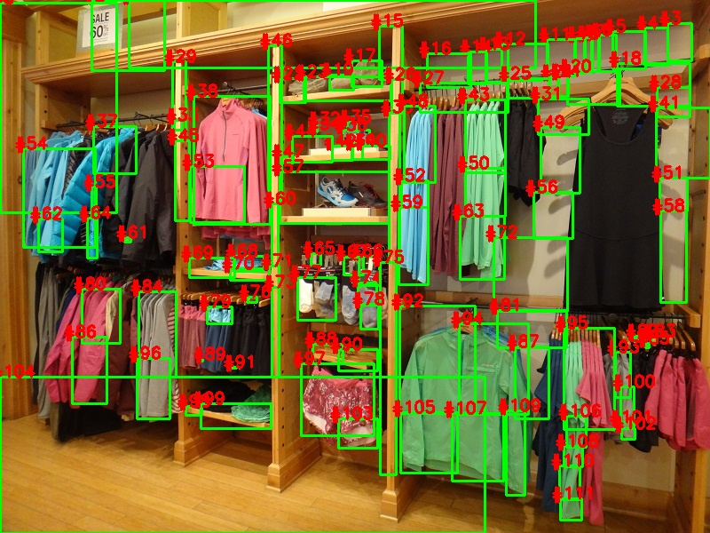
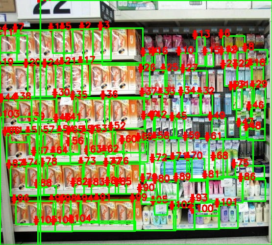
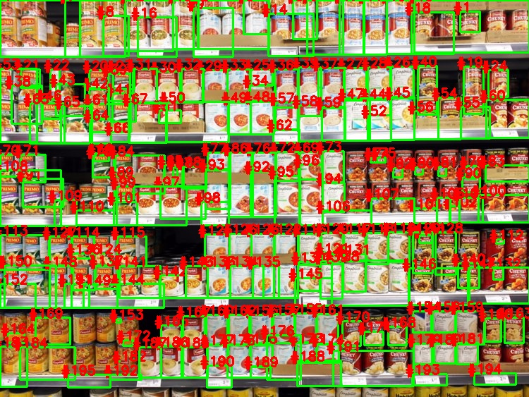

# Planogram-detection

The code has not been shared due to company's privacy policy. Access might be granted on request.

Detection of objects in store shelf. This repository consists of 3 different approaches : Selective Search, Watershed and Deep Learning
Selective requires no. of possible boxes as input.
Watershed seems to be working good unsupervised. More test results need to be seen.
Deep Learning approaches available on google drive in form of Android App 

## Results

  
   
   

### Kmeans approach:
K-means for unsupervised clusture segmentation has been applied using OpenCV, pandas, Scikit Learn. This requires a input feed of value of k (around 6 works fine as per experiments on given images) and segments those prominent regions. The major drawback of these method is that the region selection does not take into account the chances of similar object in different clusters. Also, value of k is higly subjective to the image. Additionally, this method does not take into account the similarity between two objects and focuses more on region segmentation rather than grouping. For further improvement, this method can be clubbed with vaious matching methods to intelligently form groups (I tried it later and would cover that up  in this description)

### Selective Search:
A promising method but the problem still remains the same that rather than grouping, this method focuses on forming bounding boxes and segmenting the image. This segmentation cannot be classified into good matches/regions and bad regions. Most of the time multiple regions form over single set of objects and while minimizing the segment count they become prominent ones. For further improvement, a maximum segment percent might be set for eliminating any box with more than that overlap. But this also arises one more question of which block to keep. Second approach could be to use deep learning (just like YOLO) to classify it as a good/bad match and shift and resize the box accordingly.

### Watershed:
Best results with OpenCV recieved so far without using Deep Learning. Watershed does laplacian distance tranform on images to seperate the dis-joint parts. This method yields each object as an independent box to us so we have a unique ID for each object onto the image. These objects are then matched up with each other using template matching with 95% acuracy to give regions of similar object. This in true sense is grouping and not segmentation. Problems faced by this method is:
1. If object is black color, it cannot segment it out as watershed method assumes black to be the background color.
2. Sometimes object looks so dissimilar that 95% match criteria is too high to satisf by reducing the threshold gives false positive results.

For further improvement, different matching module could be used (including DL), or even 95% would do as those false negative cases might be rejected and bounding boxes can be formed using only true positive results.

### YOLO/MobileNet/other DL approaches:
DL approaches significantly varies between laptop and mobile performance so prefer testing on mobile only. All the apps/ methods made/modified by me uses google's code/models to test and are not trained for our specific object type. This is a major drawback to test the model as it gives results on basis of pretrained dataset. Based on my experimentation, MobileNet works best in comparison to all. There is some part of android (java file) error till where I left. For further improvement, try to train MobileNet on our dataset to see if it is improving any part of our result. Later on another method struck me after a while to use Siammese Network as a template matcher in our OpenCV approach. Further more, rather than relying on puely DL approach, OpenCV result after watershed all object segmentation can be used as a feed to the network.

### Distance Measurement:
Firstly dimensions to pixel relation is estabilished at a known distance in X and Y direction using a pre-measured reference tag. These reference readings are store and used for further calculations. Now any width and height can be known using the estabilished relation. For measing this relation, HSV thresholding was done to segment out the uniquely coloured tag to seperate it out from the image.

### Links 

**Android Apps:** 

https://drive.google.com/drive/folders/1UFFbn6HY03-7SqWYJN7Tg9ubnpZb6zc2?usp=sharing
https://drive.google.com/drive/folders/1vYzk0HKjZ4_Ine5MFPsG5xw-Wp8WGLhb?usp=sharing

**All test and result images:** https://drive.google.com/drive/folders/1dKwiTsm3-hzt_xfM9BVWXIBqPS0pZM1m?usp=sharing

**Image credits:** See image urls file.

